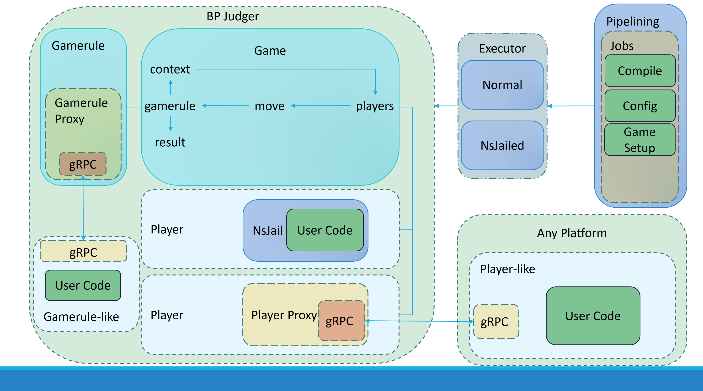

# BP Judger

Yet another botzone judger (WIP)

目前没有接口，只有测试类的代码

### game.test.ts

运行`/src/game/game.test.ts`拉起一个Pipeline

Pipeline的内容自由配置，可以是编译（支持nsjail），运行命令或者调用module，类似GitHub的workflow，目前有一个测试用的Pipeline在`/config/g++.ts`中

`sudo ts-node game.test.ts` (如果要用NsJail需要`sudo`)

Pipeline会做的事情:
  - 从`/config/g++.ts`中读取流水线配置
  - 先拉起nsjail编译代码（被注释了，暂时没用到）
  - 创建一个玩家空位，等待grpc的客户端上线（异步的，不等）
  - 测试POST模块（不知道有啥用）
  - 测试命令模块（运行一个`echo`）

然后main会等待测试游戏房间结束

Game有几个重要的对象，一个Gamerule(游戏规则)，一些Player(玩家), 一个Context(运行时产生的上下文)，之后所有的事情都会围绕这三个东西展开。

玩家加入房间，被Gamerule验证是否可以开始

Game开始后，Gamerule会根据PickPlayerStrategy(还没实现)选取玩家通过gRPC调用Move方法

Move方法接收Context（的一部分），返回一个PlayerMove. 这俩都是JSON，具体的格式是自定义的。

玩家的Move调用结束后，Gamerule会验证这个Move是否合法，如果合法，就会更新Context，并验证是否游戏结束。如果没有，继续调用下一玩家的Move方法，直到游戏结束。

### 
`/src/game/gamerules/GuessNumber/bots/BinarySearchBotUseTemplate.ts`，这个是跟上面的测试猜数字游戏配套的bot, 使用二分查找策略

`ts-node BinarySearchBotUseTemplate.ts`

### TODO LIST

- 搓各种语言的支持文件
- 搓接口
